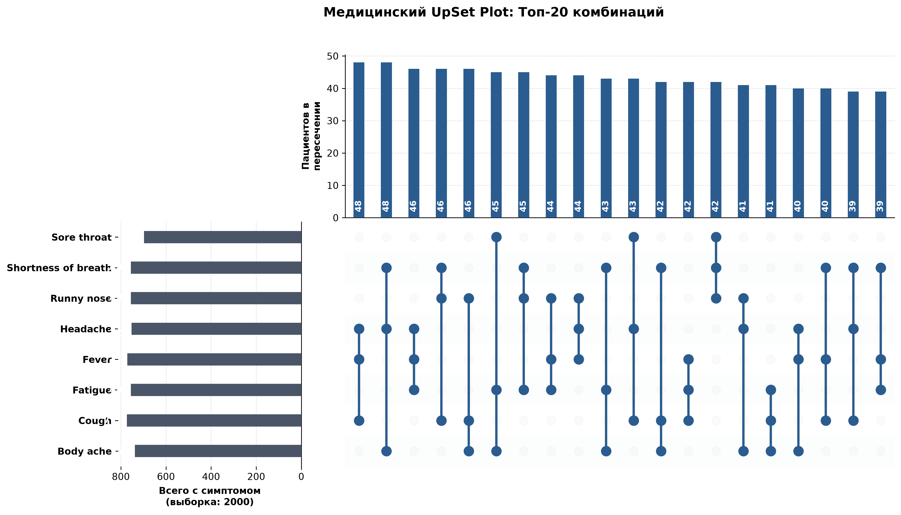
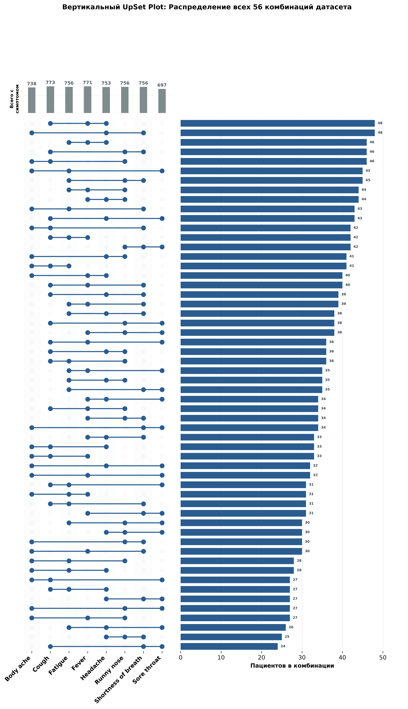

# Визуализация медицинских данных: UpSet Plot

Проект для анализа и построения графиков пересечения симптомов у пациентов.

## Пример датасета

В папке доступен файл `medical_data.csv` со структурой симптомов и показателей пациентов.

## Результаты визуализации

### Топ-20 частых комбинаций симптомов

### Полное распределение всех комбинаций

Датасет загружен с платформы Kaggle: [www.kaggle.com/datasets/s3programmer/disease-diagnosis-dataset](https://www.kaggle.com/datasets/s3programmer/disease-diagnosis-dataset)
